# Installera Guest Additions på Ubuntu

## Varför?

För att vi vill kunna ändra storlek på vm fönstret valfritt och vill kunna klippa och klistra mellan vm och host.

## Öppna en terminal

1. Klicka Show All Applications

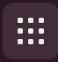

2. Klicka på Terminal

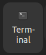

## Uppdatera repository och ladda ner uppdateringar

1. Skriv in `sudo apt update`
2. Skriv in `sudo apt upgrade`
3. Välj ja på alla frågor `Y`

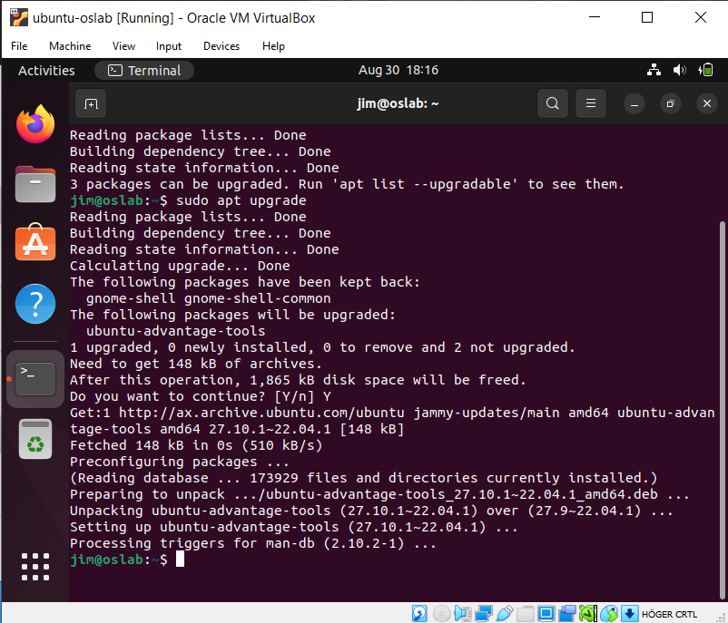

## Installera build tools

1. Skriv in `sudo apt install build-essential dkms linux-headers-$(uname -r)`
2. Välj ja på alla frågor `Y`

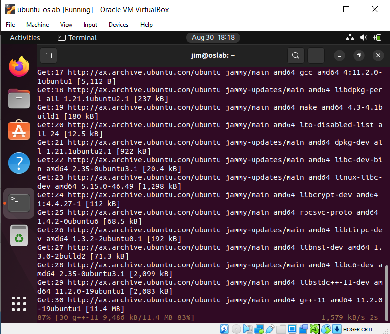

## Sätt i Guest Additions CD

1. Klicka Devices i virtualbox menyn

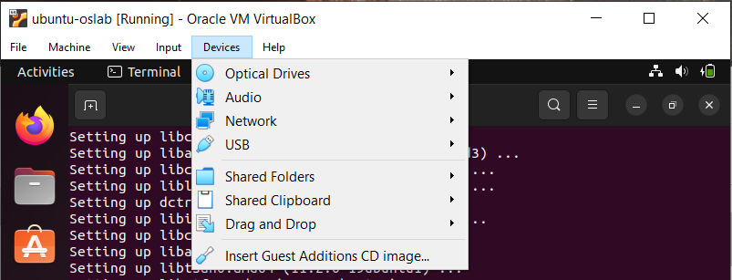

2. Välj `Insert Guest Additions CD image`

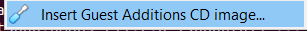

## Installera Guest Additions

1. I terminalen skriv `cd /media`
2. Skriv `ls`
3. Använd katalognamnet (förmodligen ditt användarnamn) ex `cd jim`
4. Skriv `cd VBox_GAs_6.1.36` (tab kompletering fungerar, så räcker med `V` + `tab`)
5. Skriv `sudo ./VBoxLinuxAdditions.run` (tab kompletering fungerar, så räcker med `VBoxL` + `tab`)

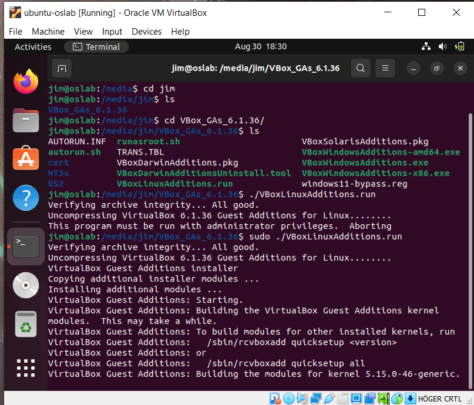

## Stäng av (när installationen är klar)

1. Klicka top menyn

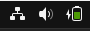

2. Välj Power Off

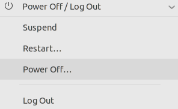

## Ta ur CDn

1. Klicka `[Optical Drive]`
2. Välj `Remove disc from virtual drive`

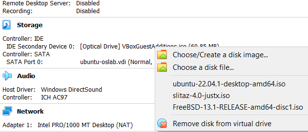

## Ställ in klipp och klistra

1. Öppna settings för ditt vm

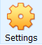

2. Välj General
3. Välj Advanced
4. Ställ in `Shared Clipboard` som Bidirectional

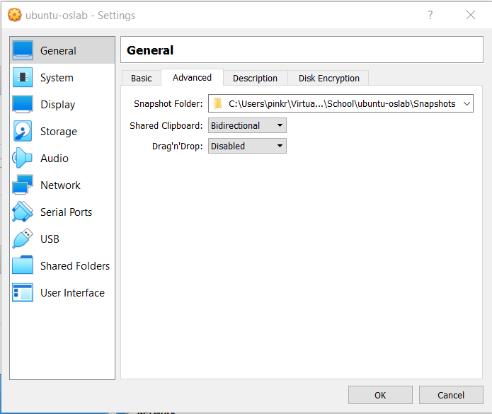

## Starta ditt vm och logga in och pröva ändra storleken på det

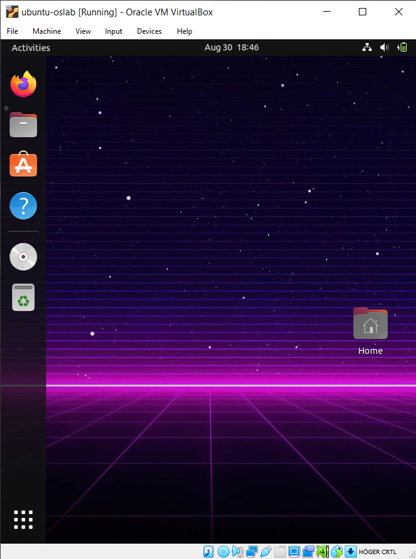

